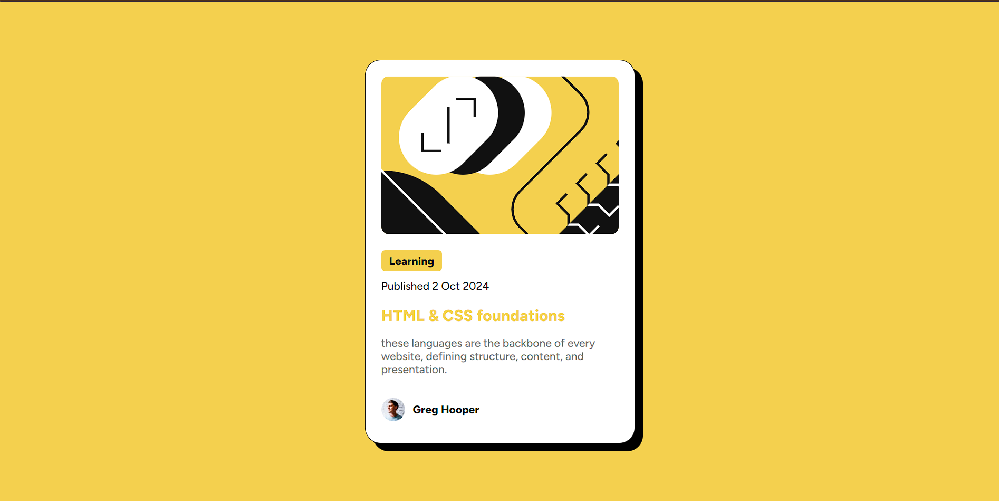

# Frontend Mentor - Blog preview card solution

This is a solution to the [Blog preview card challenge on Frontend Mentor](https://www.frontendmentor.io/challenges/blog-preview-card-ckPaj01IcS). Frontend Mentor challenges help you improve your coding skills by building realistic projects.

## Table of contents

- [Overview](#overview)
  - [The challenge](#the-challenge)
  - [Screenshot](#screenshot)
  - [Links](#links)
- [My process](#my-process)
  - [Built with](#built-with)
  - [What I learned](#what-i-learned)
  - [Continued development](#continued-development)
- [Author](#author)

**Note: Delete this note and update the table of contents based on what sections you keep.**

## Overview

### The challenge

Your challenge is to build out this blog preview card and get it looking as close to the design as possible.

You can use any tools you like to help you complete the challenge. So if you've got something you'd like to practice, feel free to give it a go.

Your users should be able to:

- See hover and focus states for all interactive elements on the page

### Screenshot



### Links

- Solution URL: [Add solution URL here](https://github.com/tasosbeast/blog-preview-card)
- Live Site URL: [Add live site URL here](https://tasosbeast.github.io/blog-preview-card/)

## My process

### Built with

- Semantic HTML5 markup
- CSS custom properties
- Flexbox
- Mobile-first workflow
- Google Fonts - For custom typography

### What I learned

During this project, I strengthened my skills in creating responsive layouts using Flexbox. I also gained experience in implementing custom CSS properties for consistent styling across the project. Here's an example of how I used CSS variables:

```css
:root {
  --yellow: hsl(47, 88%, 63%);
  --white: hsl(0, 0%, 100%);
  --grey: hsl(0, 0%, 50%);
  --black: hsl(0, 0%, 7%);
}
```

### Continued development

Moving forward, I want to focus on:

- Improving my CSS animation skills to create more dynamic user interfaces.
- Exploring CSS Grid for more complex layouts.
- Implementing accessibility features to ensure the card is usable for all users.
- Learning how to use CSS preprocessors like Sass to write more efficient styles

## Author

- Website - [tasosbeast](https://github.com/tasosbeast)
- Frontend Mentor - [@tasosbeast](https://www.frontendmentor.io/profile/tasosbeast)
